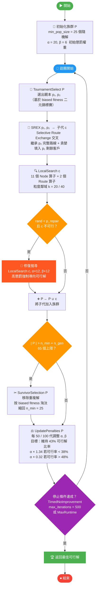

# Fig. 1 — HGS 主迴圈流程圖

> **用途**：截圖後存為 `report/figures/fig1_hgs_flowchart.png`，放入 Overleaf。
>
> **截圖方法**：
> 1. 將下方 Mermaid 程式碼貼入 [mermaid.live](https://mermaid.live)
> 2. 右側預覽調整 Theme 為 `default`（白底）
> 3. 點擊右上角 **PNG** 下載（或直接截圖）
> 4. 存為 `report/figures/fig1_hgs_flowchart.png`

---

---

## 各節點對應論文位置

| 節點 | 對應章節 |
|------|---------|
| 初始化族群 | Methods III-B, Algorithm 1 line 1–2 |
| TournamentSelect | Methods III-B §Population Management |
| SREX 交叉 | Methods III-B §SREX Crossover |
| LocalSearch | Methods III-B §Local Search（11+2 operators） |
| 修復搜尋 | Methods III-B §Dynamic Penalty（repair booster ×12） |
| SurvivorSelection | Methods III-B §Population Management（n_min=25） |
| UpdatePenalties | Methods III-B §Dynamic Penalty（43% target） |
| 停止條件 | Methods III-C（TimedNoImprovement, max_iterations=500） |
